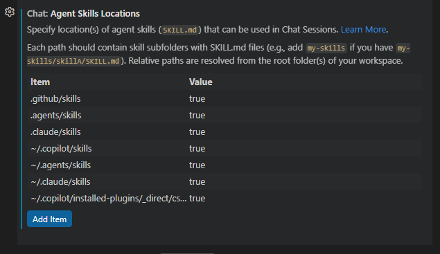

# AI-Plugins-And-Skills - VS Code Copilot

GitHub Copilot agent mode skill installation and usage guide for VS Code.

See [README.md](../README.md) for the full plugin and skill listing.

## Requirements

- **VS Code** v1.109+ (January 2026 release or later)
- **GitHub Copilot** extension with agent mode enabled
- `chat.useAgentSkills` setting enabled (on by default)

## Installation

### Option A: VS Code Settings (Recommended)

Point VS Code at the skill directories in your local clone:

```bash
# Clone this repository
git clone <<github-ai-plugins-and-skills-repo>>
```

You can also configure this in the UI: Ctrl+Shift+P > **Chat: Chat Settings**, then search for `agentSkillsLocations`.



Or edit your VS Code **user** `settings.json` directly (Ctrl+Shift+P > "Preferences: Open User Settings (JSON)"):

```json
{
  "chat.agentSkillsLocations": [
    "C:/path/to/ai-plugins-and-skills/claude-code/plugins/<<name-of-your-plugin>>/skills",
    "C:/path/to/ai-plugins-and-skills/skills"
  ]
}
```

Replace `C:/path/to/` with the actual path to your clone.

Restart VS Code. Skills are now available in agent mode. Run `Chat: Configure Skills` (Ctrl+Shift+P) to verify they appear.

### Option B: Use Copilot CLI Plugin Directory

If you already installed the plugins via [Copilot CLI](README-COPILOT-CLI.md), point VS Code at the Copilot CLI installed skills directory. VS Code does not auto-discover skills from Copilot CLI's plugin path, so you need to tell it where to look.

Open Ctrl+Shift+P > **Chat: Chat Settings** > `agentSkillsLocations`, or add to your VS Code **user** `settings.json`:

```json
{
  "chat.agentSkillsLocations": [
    "~/.copilot/installed-plugins/_direct/<<name-of-your-plugin>>/skills"
  ]
}
```

You can also add a personal skills directory for any custom skills you create:

```json
{
  "chat.agentSkillsLocations": [
    "~/.copilot/installed-plugins/_direct/<<name-of-your-plugin>>/skills",
    "~/.copilot/skills"
  ]
}
```

Restart VS Code. Run `Chat: Configure Skills` (Ctrl+Shift+P) to verify they appear.

## Usage

### Skills

Skills activate automatically in Copilot agent mode when your prompt matches their description.

| Skill | Activates When |
|-------|---------------|
| `csharp-quality-expert` | Writing or reviewing C# code |
| `codebase-mapper` | Mapping a codebase, generating architecture docs |
| `ace-fca-workflow` | Complex multi-file tasks in large codebases |

### Verifying Skills

Run `Chat: Configure Skills` from the command palette to see all discovered skills and their status.

## Updating

### Settings approach

Pull the latest changes -- VS Code picks them up on next restart:

```bash
cd ai-plugins-and-skills && git pull
```

### Copilot CLI approach

Update the plugin via Copilot CLI -- VS Code picks up the changes on next restart:

```bash
copilot plugin update ai-plugins-and-skills
```

## Current Limitations

### No Slash Commands

VS Code Copilot does not have a slash command system equivalent to Claude Code's.
### No Plugin System

VS Code Copilot loads skills individually, not as plugin bundles. There is no marketplace install or plugin management -- skills are discovered from directories.