# Test-Filter Development

## Overview

Write the test first. **Prove it can fail** — twice, for two different reasons. Then keep it.

**Core principle:** a test is worth exactly what it can detect. Everything here is machinery for
measuring that, because a test whose detection you have not measured is a claim about your software,
not a check on it.

**The name is the argument.** `test-driven-development` names an *ordering*. The ordering is not
where the value is. The **filter** is — the mechanical proof that this test fails when the behavior
is wrong. The ordering exists to protect that filter's independence, and that is a supporting role.

## Know which axis you are on

Four distinct things a test can buy you. They have **different validation bars**, and treating them
as one practice is how teams over-validate cheap tests and under-validate expensive ones.

| Axis | What it buys | Validation bar |
|---|---|---|
| **Instruction** — "write the test first" | nothing measurable on its own | n/a — treat as inert |
| **Filter** — prove the test fails for the right reason | correctness; fewer escaped defects | **high** — assertion quality is the whole product |
| **Regression net** — the test still exists when the code changes | change detection, and *naming* what moved | **low** — any test that pins behavior works, including a mediocre one |
| **Composition** — integration tests | wiring, registration, missed requirements | **scope, not quality** — unreachable by better unit tests |

**This skill is the filter axis.** The regression and composition axes get their own sections below
because they are the two places where following the filter rules alone will mislead you.

Why the bars differ: *"is this behavior right?"* needs a validated assertion. *"did this behavior
change?"* does not — a test that merely pins current output is a serviceable tripwire. The
hollow-test problem is severe for correctness and mild for regression.

## When to Use

**Always:** new features, bug fixes, behavior changes, refactoring.

**Exceptions (ask your human partner):** throwaway prototypes, generated code, configuration.

## The Cycle

```dot
digraph tfd_cycle {
    rankdir=LR;
    red        [label="RED\nWrite failing test", shape=box, style=filled, fillcolor="#ffcccc"];
    verify_red [label="Capture the\nfailure output", shape=diamond];
    green      [label="GREEN\nMinimal code", shape=box, style=filled, fillcolor="#ccffcc"];
    verify_grn [label="Capture the\npass output", shape=diamond];
    mutate     [label="MUTATE\nSeed one fault", shape=box, style=filled, fillcolor="#ffe0b3"];
    killed     [label="Suite goes red?", shape=diamond];
    refactor   [label="REFACTOR\nClean up", shape=box, style=filled, fillcolor="#ccccff"];
    next       [label="Next", shape=ellipse];

    red -> verify_red;
    verify_red -> green    [label="fails for\nthe right reason"];
    verify_red -> red      [label="passes, errors,\nor wrong failure"];
    green -> verify_grn;
    verify_grn -> mutate   [label="yes"];
    verify_grn -> green    [label="no"];
    mutate -> killed;
    killed -> refactor     [label="yes — restore\nthe code"];
    killed -> red          [label="no — mutant\nsurvived: the test\nis rejected"];
    refactor -> verify_grn [label="stay green"];
    verify_grn -> next;
    next -> red;
}
```



Two rejection edges, not one. `verify_red → red` catches a test that cannot detect *absent*.
`killed → red` catches a test that cannot detect *wrong*. **They are different faults and the first
check does not find the second.**

---

## RED — Write One Failing Test

One minimal test showing what should happen.

<Good>
```typescript
test('retries failed operations 3 times', async () => {
  let attempts = 0;
  const operation = () => {
    attempts++;
    if (attempts < 3) throw new Error('fail');
    return 'success';
  };

  const result = await retryOperation(operation);

  expect(result).toBe('success');
  expect(attempts).toBe(3);
});
```
Clear name, real behavior, one thing, and there is a change to the production code that would
break it.
</Good>

<Bad>
```typescript
test('retry works', async () => {
  const mock = jest.fn()
    .mockRejectedValueOnce(new Error())
    .mockRejectedValueOnce(new Error())
    .mockResolvedValueOnce('success');
  await retryOperation(mock);
  expect(mock).toHaveBeenCalledTimes(3);
});
```
Vague name, and it asserts on the mock — so it measures your test setup, not the retry logic.
</Bad>

**Requirements:**
- One behavior
- Clear name
- Real code (see [the composition axis](#the-composition-axis--what-no-filter-reaches) for why
  every mock costs you something specific)
- **You can name the change to production code that would make it fail.** If you cannot, the test is
  already hollow and no later step will save it.

## Verify RED — Capture the Failure, Do Not Attest It

**MANDATORY. This is the step the whole skill exists to protect.**

```bash
npm test path/to/test.test.ts        # or: dotnet test --filter FullyQualifiedName~RetriesFailed
```

Confirm three things:

1. The test **fails** — it does not error
2. The failure message is the one you expected
3. It fails **because the feature is missing**, not because of a typo, a missing import, or a
   broken fixture

**Then put the output where a reviewer can see it.** The transcript, the PR description, or the
commit body — the command you ran and what it printed.

> **"Watched it fail" is a claim. The failure output is a result.**
>
> A checkbox saying a test was run is exactly the artifact this practice exists to distrust, aimed
> at the enforcement mechanism instead of at the code. An agent asserting it ran something is not
> evidence that anything ran.

| Outcome | What it means | Do this |
|---|---|---|
| Test passes | You are testing behavior that already exists | Fix the test. It is not testing the new thing. |
| Test errors | Setup problem, not a behavioral check | Fix the error, re-run until it *fails* |
| Fails, wrong message | It is detecting something else | Back to RED |

**What this step proves, and what it does not.** RED proves the test detects *the function is
absent*. It does not prove the test detects *the function is present and computing the wrong thing*.
That is a strictly easier fault to catch, and a test can pass RED while being hollow against every
real defect. Which is why there is a second mutant.

## GREEN — Minimal Code

Simplest code that passes.

<Good>
```typescript
async function retryOperation<T>(fn: () => Promise<T>): Promise<T> {
  for (let i = 0; i < 3; i++) {
    try {
      return await fn();
    } catch (e) {
      if (i === 2) throw e;
    }
  }
  throw new Error('unreachable');
}
```
Just enough to pass.
</Good>

<Bad>
```typescript
async function retryOperation<T>(
  fn: () => Promise<T>,
  options?: { maxRetries?: number; backoff?: 'linear' | 'exponential' }
): Promise<T> { /* YAGNI */ }
```
Over-engineered, and every unrequested branch is untested surface.
</Bad>

Do not add features, refactor neighbouring code, or improve beyond the test.

## Verify GREEN — Capture That Too

**MANDATORY.** Same standard: run it, keep the output.

Confirm: the test passes, the other tests still pass, and the output is pristine — no errors, no
warnings.

**Test fails?** Fix the code, not the test. **Other tests fail?** Fix now, not later.

## MUTATE — Seed One Fault and Watch the Suite Catch It

**MANDATORY, and new. This is the step `test-driven-development` does not have.**

The test is green. Nothing so far has proven it can detect a *wrong answer* — only a missing one. So
introduce a wrong answer on purpose.

```
1. Pick one mutant in the code under test  — invert a condition, return a constant,
                                             change a boundary, drop a call
2. Run the tests that cover it
3. The suite MUST go red
4. Restore the code
5. Confirm the restore:  git diff  — must be empty for the mutated file
```

Seconds to run, fully deterministic, and it catches the entire class of defect RED structurally
cannot see. Per-language recipes and the restore checklist: [`seeding-mutants.md`](seeding-mutants.md).

### Rejection on survival

**A suite that stays green through the mutant is rejected, not noted.** Same semantics RED already
has:

```
Mutant survived  →  the test does not test the behavior it claims to
                 →  strengthen the assertion
                 →  re-run the mutant
                 →  only then continue
```

"Coverage was fine" and "the test looks thorough" are not counter-arguments. The mutant is the
argument. A surviving mutant is a demonstration that the behavior can break with your suite green,
and you have just performed it.

### Mutation is a filter, never a score

> Treat mutation as a **filter** — *does this test kill this specific seeded fault, yes or no* — and
> never as a percentage to optimize toward.

Binary and per-mutant, or not at all. This is not a stylistic preference:

- The production evidence (Meta's ACH) is for the filter form — seed a specific mutant, keep the
  test that kills it.
- Mutation score's correlation with real-fault detection is **an open question specifically for
  LLM-generated suites** (arXiv:2607.22880). Do not build a stopping rule on a number whose
  validity is under active challenge.
- A percentage target invites tests written to move the percentage. That is the hollow-test failure
  mode with a metric attached.

Where a mutation tool exists (Stryker.NET, StrykerJS), use it to *generate candidate mutants* and
still judge them one at a time. Do not set a threshold gate.

## REFACTOR — Clean Up

After green only: remove duplication, improve names, extract helpers. Keep tests green, add no
behavior.

A test that survived both filters is what makes this safe. That is the payoff for the two extra
steps — you are refactoring under a net you have actually load-tested.

---

## The Regression Axis — the Test's Second Job

The filter is about the test's value *today*, when the behavior is new. A test earns value again
**later, when someone changes the code**, and that is a different mechanism with a different bar.

| | Filter | Regression net |
|---|---|---|
| Question answered | Is this behavior right? | Did this behavior change? |
| Needs a validated assertion | **Yes** | No |
| A mediocre test that merely pins output | Worthless | **Serviceable** |

Two consequences that matter in practice:

- **Do not delete a pinning test for being unvalidated.** It is doing the regression job. Fix it if
  you need correctness evidence from it; do not remove the tripwire.
- **Do not accept a pinning test as correctness evidence.** Passing means "unchanged", not "right".

And the benefit that survives even a weak test: a failing test does not only detect, it **names**.
It tells you *which behavior moved*. Reading a test name beats diagnosing a regression cold at 2am,
and that is the whole reason an agent with a test suite outperforms one without — the suite reports
on behavior in words, which is the only form either of you can act on.

This is the best-evidenced axis of the four: agent held fixed, only the regression set added,
+9.4% / +8.0% resolved with cost and step count *falling* (TestPrune, arXiv:2510.18270).

## The Composition Axis — What No Filter Reaches

A perfect filter cannot expand a test's scope.

> **A mock is an unverified claim about how the system composes.**

In a mocked unit test the mock *is* the registration you forgot. You supply by hand the exact thing
production does not supply, so the test passes **because of** the defect rather than despite it.

The canonical case: a service is written, unit-tested, green on every assertion, mutation-checked,
and **never added to the bootstrap**. It is dead in production and your suite has nothing to say
about it. No amount of better unit testing reaches this. A suite at a perfect mutation score with
every assertion validated is still green.

**Why this is characteristic of AI-assisted work rather than merely common:** the agent writes the
service in one file; the composition root is a different file, frequently not in context. It emits
plausible code for the thing and never sees the assembled system.

What follows:

- Every mock is a scope reduction you are choosing. Name what it costs you before adding it.
- **For any bug that could live in more than one component, the integration test is mandatory**, and
  you may not mock the component the bug might live in. See the testing protocol in `CLAUDE.md` —
  this predates the argument, which is what makes it worth citing.
- Require at least one E2E integration test per feature via `WebApplicationFactory<TProgram>`
  (or your stack's equivalent full-composition harness) for exactly this reason.

---

## On the Ordering

Write the test first. The reason is narrow and worth stating once, because it is not the reason
usually given:

**A test written after the code is conditioned on the code.** You test what you built rather than
what was required, and you verify the edge cases you remembered rather than the ones the
specification implies. Test-first preserves independence between the specification and the
implementation, and that independence is what the filter measures against (arXiv:2607.05139).

So: write code before the test, and you have lost the independence. Delete it and implement fresh
from the test. Not kept as reference, not adapted — those are testing-after with extra steps.

That is the entire case for the ordering. **Do not mistake it for the case for the practice.**
Prompt-level interventions that add or remove test-writing shift agent outcomes by at most ~2.6pp
across six frontier models (arXiv:2602.07900). The ordering is cheap and worth keeping; it is not
the thing doing the work, and arguing about it at length is arguing about the inert axis.

If you catch yourself constructing a reason to skip a step, the reason is almost always one of
these, and none of them survive contact with the filter: *too simple to test* (simple code breaks),
*I'll test after* (tests that pass immediately prove nothing), *already manually tested* (no record,
cannot re-run), *deleting hours of work is wasteful* (sunk cost; unverified code is the debt),
*hard to test means the design is fine* (listen to the test — hard to test is hard to use).

---

## Good Tests

| Quality | Good | Bad |
|---|---|---|
| **Detects something** | You can name the mutant it kills | Nothing you could break would fail it |
| **Minimal** | One thing. "and" in the name? Split it. | `test('validates email and domain and whitespace')` |
| **Clear** | The name states the behavior | `test('test1')` |
| **Shows intent** | Demonstrates the desired API | Obscures what the code should do |

## When Stuck

| Problem | Solution |
|---|---|
| Don't know how to test | Write the wished-for API. Write the assertion first. Ask your human partner. |
| Test too complicated | The design is too complicated. Simplify the interface. |
| Must mock everything | Too coupled. Use dependency injection — and note the scope you are losing. |
| Test setup huge | Extract helpers. Still complex? Simplify the design. |
| Cannot find a mutant that survives | Good. Record which mutants you tried; that list is the evidence. |
| Every mutant survives | The test asserts nothing. Rewrite the assertion, not the mutant. |

## Debugging Integration

Bug found? Write the failing test that reproduces it, then run the full cycle. The bug **is** the
mutant — it is a real fault, already seeded for you by reality, and a test that fails on it and
passes on the fix has been validated by the best mutant available.

Never fix a bug without a test that reproduces it first.

## Testing Anti-Patterns

Read [`testing-anti-patterns.md`](testing-anti-patterns.md) when adding mocks or test utilities:
testing mock behavior, test-only methods in production classes, mocking without understanding the
dependency chain, and incomplete mocks.

---

## Verification Checklist

**Every box needs an artifact, not a memory.** A checked box whose evidence you cannot produce is
the failure mode this skill is named after.

| # | Requirement | Evidence |
|---|---|---|
| 1 | Every new behavior has a test | the test file |
| 2 | Each test failed before implementation | **the captured failure output** |
| 3 | Each failure was for the intended reason | the failure message, read and quoted |
| 4 | Minimal code written to pass | the diff |
| 5 | All tests pass, output pristine | **the captured pass output** |
| 6 | A mutant was seeded and killed | the mutant described, and the red run it caused |
| 7 | The mutant is gone | `git diff` clean on the mutated file |
| 8 | Composition is covered | an integration test that does not mock the wiring |

Cannot produce the evidence for a box? Then that box is unchecked, whatever you believe about it.

## The Standard, in Two Lines

```
Production code  →  a test that failed first, for the right reason, with the output to show it
                 →  and that a seeded fault in that code makes fail again
Otherwise        →  you have coverage, not a filter
```

## Honest About the Evidence

This skill hardens the leg of the argument that has support. It does not supply the leg that does
not.

| Claim | Standing |
|---|---|
| A verifiable filter improves the quality of accepted tests | **Strongest.** ACH in production at Meta: 10,795 classes, 571 hardening tests, 73% engineer acceptance. Removing MuTAP's mutation loop dropped fault detection 50% — the largest single ablation in the literature. |
| Existing regression tests improve agent outcomes | **Cleanest ablation.** TestPrune, agent held fixed: +9.4% / +8.0%, McNemar tested, cost down. |
| Test authorship (human vs agent) is the variable | **False.** Validity is. On instances where all self-generated tests were genuine fail-to-pass, TDFlow resolved 93.3%. |
| A test-first *instruction* improves agent output | **Unsupported.** ~2.6pp, six frontier models. |
| Integration tests catch what unit tests cannot | Mechanism and field practice; **no isolated empirical study.** Held at the same confidence as the grounding argument, deliberately. |
| Mutation *score* is a valid stopping rule | **Open question** for LLM-generated suites (arXiv:2607.22880). Hence: filter, never score. |

Full brief with primary identifiers:
[`tdd-agent-evidence-gap.md`](tdd-agent-evidence-gap.md).
The mechanism this all rests on:
[`tests-as-grounding.md`](tests-as-grounding.md).
